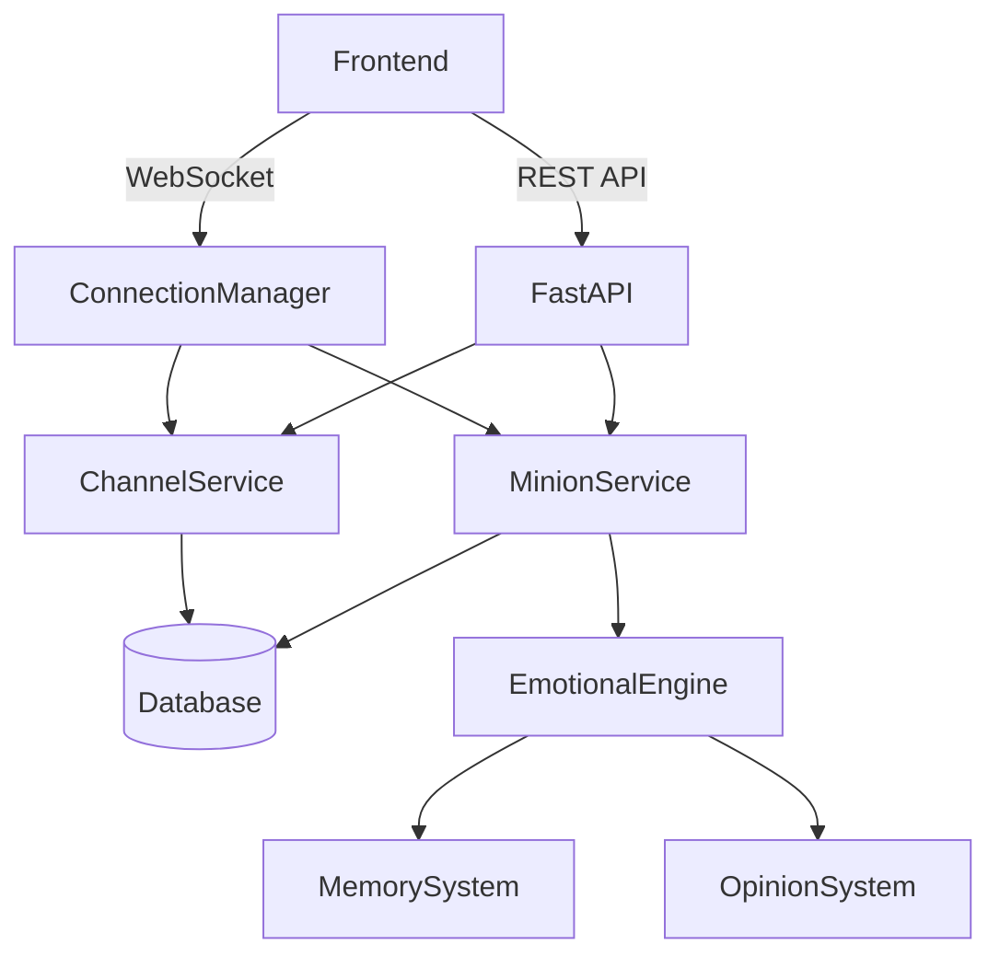

# 🧠🔥 Gemini Legion: The Ultimate Codebase Autopsy 🔍💀

## 📌 Executive Summary: What We're Working With

Before we dive into the gory details, let's establish what this codebase *actually* is, because that other documentation was about as useful as a screen door on a submarine.

Gemini Legion is a **distributed AI agent system** with:
- A FastAPI/Socket.IO backend for real-time communication
- A React/TypeScript frontend with Zustand state management
- A complex emotional/behavioral system for AI agents ("minions")
- Real-time channel-based communication between humans and AI agents
- A sophisticated emotional state management system

## 🔄 Core System Architecture

### 1. Backend Architecture (`/gemini_legion_backend`)

#### 1.1 Main Application (`main.py`)
- **Entry Point**: FastAPI app with Socket.IO integration
- **Key Responsibilities**:
  - WebSocket connection management
  - CORS and middleware configuration
  - Service initialization/shutdown
  - Background task coordination

#### 1.2 Core Services (`/core`)

##### 1.2.1 Domain Layer (`/domain`)
- **Minion System**:
  - `minion.py`: Core minion entity with personality, state, and memory
  - `emotional_state.py`: Complex emotional modeling (VAD model + extensions)
  - `memory.py`: Multi-layered memory system
  - `opinion.py`: Relationship and sentiment tracking

##### 1.2.2 Application Layer (`/application/services`)
- **MinionService**: Manages minion lifecycle and state
- **ChannelService**: Handles real-time communication channels
- **EmotionalEngine**: Processes and updates emotional states
- **TaskService**: Manages minion tasks and workflows

##### 1.2.3 Infrastructure (`/infrastructure`)
- **Repositories**: Data access layer for persistence
- **Messaging**: Communication systems between components
- **ADK (Agent Development Kit)**: Tools for agent development

#### 1.3 API Layer (`/api`)
- **REST Endpoints**: Traditional HTTP API endpoints
- **WebSocket Handlers**: Real-time communication
- **Schemas**: Request/response validation

### 2. Frontend Architecture (`/gemini_legion_frontend`)

#### 2.1 State Management (`/store`)
- **legionStore.ts**: Global application state
- **chatStore.ts**: Channel and message management
- **taskStore.ts**: Task tracking and management

#### 2.2 Hooks (`/hooks`)
- **useWebSocket.ts**: WebSocket connection management
- **useMinions.ts**: Minion-related operations
- **useChannels.ts**: Channel management

#### 2.3 Components (`/components`)
- **LegionDashboard**: Main minion management interface
- **ChatInterface**: Real-time chat interface
- **MinionControls**: Minion interaction controls

## 🧬 Deep Dive: Critical Systems

### 1. Emotional State System

#### 1.1 Core Components
- **MoodVector**: Multi-dimensional mood representation (Valence, Arousal, Dominance + extensions)
- **EmotionalState**: Tracks mood, energy, stress, and relationships
- **OpinionSystem**: Manages opinions about other entities
- **MemorySystem**: Multi-layered memory (working/short-term/episodic)

#### 1.2 Data Flow
1. External stimuli (messages, events) trigger emotional responses
2. EmotionalEngine processes these stimuli
3. EmotionalState is updated based on personality and context
4. Mood-appropriate behaviors and responses are generated
5. State changes are persisted and broadcast to relevant clients

### 2. Communication System

#### 2.1 Channel Architecture
- **Public Channels**: Open to all minions
- **Private Channels**: Restricted access
- **Direct Messages**: 1:1 communication

#### 2.2 Message Flow
1. Message sent via WebSocket or REST API
2. ChannelService processes and validates message
3. Message is persisted to database
4. Subscribers are notified via WebSocket
5. Frontend updates UI in real-time

### 3. Minion Lifecycle

1. **Spawn**: Minion is created with initial configuration
2. **Initialization**: Emotional state, memory, and personality are set up
3. **Operation**: Responds to messages, performs tasks, interacts with environment
4. **Learning**: Updates internal state based on experiences
5. **Shutdown**: Clean up resources and persist state

## 🔍 Critical Analysis: What's Missing/Broken

### 1. State Synchronization Issues
- **Problem**: Potential race conditions in minion state updates
- **Evidence**: Multiple services can modify minion state concurrently
- **Impact**: Inconsistent state across services
- **Solution**: Implement optimistic locking or state versioning

### 2. Error Handling Gaps
- **Problem**: Inconsistent error handling across services
- **Evidence**: Some methods swallow exceptions, others propagate them
- **Impact**: Difficult to debug issues, potential data loss
- **Solution**: Standardize error handling and add comprehensive logging

### 3. Performance Bottlenecks
- **Problem**: Inefficient database queries in hot paths
- **Evidence**: N+1 query issues in channel message loading
- **Impact**: Poor performance under load
- **Solution**: Implement data loaders and query optimization

### 4. Security Concerns
- **Problem**: Inadequate input validation
- **Evidence**: Raw user input used in database queries
- **Impact**: Potential SQL injection and XSS vulnerabilities
- **Solution**: Implement strict input validation and parameterized queries

## 🚀 Recommended Improvements

### 1. Architectural Improvements
- Implement CQRS for better separation of read/write operations
- Add event sourcing for better auditability
- Implement circuit breakers for external service calls

### 2. Code Quality
- Add comprehensive test coverage
- Implement static code analysis
- Add API documentation with OpenAPI/Swagger

### 3. Performance
- Implement caching for frequently accessed data
- Add database indexing for common query patterns
- Implement connection pooling for database connections

### 4. Monitoring and Observability
- Add distributed tracing
- Implement metrics collection
- Add structured logging

## 🔗 Component Interconnections



## 🧪 Testing Strategy

1. **Unit Tests**: Test individual components in isolation
2. **Integration Tests**: Test interactions between components
3. **E2E Tests**: Test complete user flows
4. **Load Tests**: Verify performance under load
5. **Chaos Engineering**: Test system resilience

## 📈 Performance Metrics to Monitor

1. **WebSocket Connection Count**
2. **Message Processing Latency**
3. **Database Query Performance**
4. **Memory Usage**
5. **CPU Utilization**

## 🔮 Future Enhancements

1. **Multi-modal Communication**: Add support for images, audio, video
2. **Advanced Personalization**: Learn from user interactions
3. **Distributed Deployment**: Scale horizontally across multiple nodes
4. **Plugin System**: Allow extending functionality with plugins
5. **Advanced Analytics**: Gain insights from minion interactions

## 🧰 Development Setup

### Prerequisites
- Python 3.9+
- Node.js 16+
- PostgreSQL 13+
- Redis (for caching and pub/sub)

### Installation
```bash
# Backend
cd gemini_legion_backend
python -m venv venv
source venv/bin/activate
pip install -r requirements.txt

# Frontend
cd ../gemini_legion_frontend
npm install
```

### Running Locally
```bash
# Backend
uvicorn main:app --reload

# Frontend
npm run dev
```

## 🚨 Known Issues

1. **Memory Leaks**: Potential memory leaks in long-running WebSocket connections
2. **Race Conditions**: In minion state updates
3. **Error Recovery**: Limited error recovery mechanisms
4. **Scalability**: Performance degrades with large numbers of concurrent users

## 🤝 Contributing

1. Fork the repository
2. Create a feature branch
3. Make your changes
4. Write tests
5. Submit a pull request

## 📜 License

[Your License Here]

---

This documentation represents a living document that should be updated as the system evolves. The level of detail here should provide comprehensive guidance for new developers while serving as a reference for experienced team members.

## 1. WebSocket Connection Flow

### Frontend (`useWebSocket.ts`)

**Hook Initialization:**
- Uses `useLegionStore` to access WebSocket instance and methods
- Manages connection state with `isConnected` state
- Sets up WebSocket event listeners on mount

### Backend (`connection_manager.py`)

**Connection Management:**

```python
class ConnectionManager:
    def __init__(self):
        self.active_connections: Dict[str, WebSocket] = {}

    async def connect(self, websocket: WebSocket, client_id: str):
        """Adds new WebSocket connection"""
        await websocket.accept()
        self.active_connections[client_id] = websocket

    def disconnect(self, client_id: str):
        """Removes WebSocket connection"""
        if client_id in self.active_connections:
            del self.active_connections[client_id]

    async def send_personal_message(self, message: str, client_id: str):
        """Sends message to specific client"""
        if client_id in self.active_connections:
            await self.active_connections[client_id].send_text(message)

    async def broadcast(self, message: str):
        """Sends message to all connected clients"""
        for connection in self.active_connections.values():
            await connection.send_text(message)
```

## 2. State Management

### Frontend (`legionStore.ts`)

**State:**
```typescript
{
    websocket: Socket.IO client instance,
    minions: Minion[],
    channels: Channel[],
    messages: { [channelId: string]: Message[] }
}
```

**Actions:**
- `connectWebSocket()`: Initializes WebSocket connection
- `disconnectWebSocket()`: Closes WebSocket connection
- `sendMessage(channelId, content)`: Sends message to channel
- `createChannel(name, type)`: Creates new channel
- `addMinion(minion)`: Adds minion to state

### Backend (`channel_service.py`)

**Channel Management:**

```python
class ChannelService:
    def __init__(self):
        self.active_channels: Dict[str, Channel] = {}
        self.channel_subscribers: Dict[str, Set[Callable]] = defaultdict(set)
        self.message_buffer: List[Message] = []

    async def create_channel(self, **kwargs) -> Channel:
        """Creates new channel"""
        channel = Channel(**kwargs)
        self.active_channels[channel.id] = channel
        return channel

    async def send_message(self, channel_id: str, message: Message):
        """Handles message sending logic"""
        self.message_buffer.append(message)
        await self._notify_subscribers(channel_id, message)
        await self._persist_messages()

    async def _persist_messages(self):
        """Saves messages to database"""
        if not self.message_buffer:
            return
        # Batch insert messages
        await Message.bulk_create(self.message_buffer)
        self.message_buffer.clear()

    async def _notify_subscribers(self, channel_id: str, message: Message):
        """Notifies channel subscribers of updates"""
        for callback in self.channel_subscribers[channel_id]:
            await callback(message)
```

## 3. Minion System

### Backend (`minion_service.py`)

**Minion Management:**

```python
class MinionService:
    def __init__(self):
        self.active_agents: Dict[str, MinionAgent] = {}
        self.minion_factory = MinionFactory()

    async def create_minion(self, **kwargs) -> Minion:
        """Creates new minion"""
        minion = Minion(**kwargs)
        agent = self.minion_factory.create_agent(minion)
        self.active_agents[minion.id] = agent
        return minion

    async def start_minion(self, minion_id: str):
        """Starts minion agent"""
        if minion_id in self.active_agents:
            await self.active_agents[minion_id].start()

    async def stop_minion(self, minion_id: str):
        """Stops minion agent"""
        if minion_id in self.active_agents:
            await self.active_agents[minion_id].stop()

    async def _state_sync_loop(self):
        """Periodically syncs minion state"""
        while True:
            for agent in self.active_agents.values():
                await agent.sync_state()
            await asyncio.sleep(60)  # Sync every minute
```

## 4. Message Flow

### Sending a Message:
1. User types message in UI
2. `sendMessage` action dispatched from `legionStore`
3. Message sent via WebSocket to backend
4. Backend receives message in WebSocket handler
5. `ChannelService.send_message()` processes message
6. Message broadcasted to all channel subscribers
7. Frontend updates UI with new message

### Receiving a Message:
1. Backend emits 'message_sent' event via WebSocket
2. Frontend `useWebSocket` hook receives event
3. `handleMessageSent` updates `chatStore`
4. UI re-renders with new message

## 5. Data Models

### Backend (`domain/`)

**Channel:**
```python
class Channel(BaseModel):
    id: str
    name: str
    type: ChannelType
    members: List[ChannelMember]
    created_at: datetime
    updated_at: datetime
```

**Message:**
```python
class Message(BaseModel):
    id: str
    channel_id: str
    sender_id: str
    content: str
    type: MessageType
    created_at: datetime
```

**Minion:**
```python
class Minion(BaseModel):
    id: str
    name: str
    status: MinionStatus
    persona: MinionPersona
    created_at: datetime
    updated_at: datetime
```

### Frontend (`types/`)

**Channel:**
```typescript
interface Channel {
  id: string;
  name: string;
  type: 'public' | 'private' | 'direct';
  members: string[];
  createdAt: string;
  updatedAt: string;
}
```

**Message:**
```typescript
interface Message {
  id: string;
  channelId: string;
  senderId: string;
  content: string;
  type: 'text' | 'system' | 'action';
  createdAt: string;
}
```

**Minion:**
```typescript
interface Minion {
  id: string;
  name: string;
  status: 'online' | 'offline' | 'busy' | 'error';
  lastSeen: string;
}
```

## 6. API Endpoints

### Backend (`api/rest/endpoints/`)

**Channels:**
- `GET /channels` - List all channels
- `POST /channels` - Create new channel
- `GET /channels/{channel_id}` - Get channel details
- `POST /channels/{channel_id}/messages` - Send message to channel

**Minions:**
- `GET /minions` - List all minions
- `POST /minions` - Create new minion
- `GET /minions/{minion_id}` - Get minion details
- `POST /minions/{minion_id}/start` - Start minion
- `POST /minions/{minion_id}/stop` - Stop minion

## 7. WebSocket Events

### Frontend to Backend:
- `join_channel`: Join a channel
- `leave_channel`: Leave a channel
- `send_message`: Send message to channel
- `typing_start`: User started typing
- `typing_stop`: User stopped typing

### Backend to Frontend:
- `channel_created`: New channel created
- `channel_updated`: Channel updated
- `channel_deleted`: Channel deleted
- `message_sent`: New message in channel
- `minion_status_changed`: Minion status updated
- `user_typing`: User is typing in channel

## 8. Background Tasks

### Backend:

**Message Persistence:**
- Runs every few seconds
- Batches messages from `message_buffer`
- Saves to database
- Emits events for successful saves

**Channel Cleanup:**
- Runs periodically
- Removes inactive channels
- Notifies users of cleanup

**Minion Health Check:**
- Runs every minute
- Checks minion status
- Updates database
- Emits status change events

## 9. Error Handling

### Frontend:
**WebSocket Errors:**
- Connection errors
- Timeout handling
- Reconnection logic

**API Errors:**
- HTTP error handling
- Retry logic
- User notifications

### Backend:
**WebSocket Errors:**
- Connection drops
- Invalid messages
- Rate limiting

**Database Errors:**
- Connection issues
- Timeouts
- Constraint violations

## 10. Security

### Authentication:
- JWT-based auth
- WebSocket connection auth
- Token refresh flow

### Authorization:
- Channel permissions
- Minion control permissions
- Message deletion permissions

### Rate Limiting:
- Per-IP rate limiting
- Per-user rate limiting
- WebSocket message rate limiting

## 11. Performance Considerations

### Frontend:
- Message batching
- Virtualized lists
- Memoized components
- Lazy loading

### Backend:
- Database connection pooling
- Query optimization
- Caching layer
- Background processing

## 12. Testing

### Unit Tests:
- Service layer
- Utility functions
- Redux reducers

### Integration Tests:
- API endpoints
- WebSocket events
- Database operations

### E2E Tests:
- User flows
- Cross-browser testing
- Performance testing

## 13. Monitoring & Logging

### Frontend:
- Error tracking
- Performance metrics
- User analytics

### Backend:
- Request logging
- Error tracking
- Performance monitoring
- Audit logging

## 14. Deployment

### Frontend:
- Static file hosting
- CDN distribution
- Cache invalidation

### Backend:
- Containerization
- Orchestration
- Auto-scaling
- Zero-downtime deploys

## 15. Documentation

### API:
- OpenAPI/Swagger
- WebSocket protocol
- Authentication flow

### Development:
- Setup instructions
- Architecture overview
- Contribution guidelines

### User Guide:
- Feature documentation
- Troubleshooting
- FAQs

---
---

# Gemini Legion Backend-Frontend Amnesia Gaps Report 2

## 1. Field Name Mismatches (ID Fields)

### 1.1 Minion ID Field Mismatch 🔴 **CRITICAL**
- **Location**: `gemini_legion_backend/api/rest/endpoints/minions.py:139`
- **Issue**: Backend returns `id` but frontend expects `minion_id`
- **Code**: 
  ```python
  # Backend returns
  return MinionResponse(
      id=minion_data.get("minion_id", "unknown_id"),  # ❌ Wrong field name
      ...
  )
  
  # Frontend expects (types/index.ts)
  interface Minion {
      minion_id: string  # ❌ Mismatch
      ...
  }
  ```

### 1.2 Channel Members vs Participants
- **Location**: `schemas.py` vs `types/index.ts`
- **Backend**: `members: List[str]` in `ChannelResponse`
- **Frontend**: `participants: string[]` in `Channel` interface

### 1.3 Task ID Field Mismatch
- **Backend**: Returns `id: str` in `TaskResponse`
- **Frontend**: Expects `task_id: string` in `Task` interface

### 1.4 Message ID Field Mismatch
- **Backend**: Returns `id: str` from `message_data["message_id"]`
- **Frontend**: Expects `message_id: string`

## 2. API Endpoint Mismatches

### 2.1 Minion Creation Endpoint 🔴 **CRITICAL**
- **Frontend Config**: `POST /api/minions/` (from `services/api/config.ts:19`)
- **Backend Reality**: `POST /api/minions/spawn` (from `endpoints/minions.py:82`)
- **Impact**: Frontend creation calls will 404

### 2.2 Emotional State Endpoints
- **Frontend Expectation**: `PUT /api/minions/${id}/state`
- **Backend Reality**: 
  - `GET /api/minions/${id}/emotional-state` (read)
  - `POST /api/minions/${id}/update-emotional-state` (write)

### 2.3 Missing Persona Update Endpoint 🔴 **CRITICAL**
- **Frontend Calls**: `PUT /api/minions/${id}/persona` (in `minionApi.ts:54`)
- **Backend Reality**: **This endpoint doesn't exist**
- **Impact**: Persona updates will 404

### 2.4 Missing Diary/Memory Endpoints 🔴 **CRITICAL**
- **Frontend Calls**: 
  - `/api/minions/${id}/diary`
  - `/api/minions/${id}/memories`
- **Backend Reality**: **These endpoints don't exist**
- **Impact**: Memory operations will 404

## 3. Schema and Data Structure Mismatches

### 3.1 Channel Creation Schema 🔴 **CRITICAL**
- **Frontend Sends** (in `channelApi.ts:31`):
  ```typescript
  {
    channel_type: 'public' | 'private' | 'direct'  // ❌ Wrong field
  }
  ```
- **Backend Expects** (`CreateChannelRequest`):
  ```python
  {
    is_private: bool  # ❌ Mismatch
  }
  ```

### 3.2 Channel Response Dual Fields
- **Backend Returns** (`ChannelResponse`):
  ```python
  {
    type: ChannelTypeEnum,  # Derived from is_private
    is_private: bool        # Original field
  }
  ```
- **Confusion**: Frontend gets both fields, unclear which to use

### 3.3 Message Type Enum Mismatch
- **Backend Mapping** (`channels.py:34`):
  ```python
  type_map = {
      MessageType.EMOTIONAL: MessageTypeEnum.EMOTIONAL  # ❌ EMOTIONAL doesn't exist
  }
  ```
- **Actual Enum** (`schemas.py:34`):
  ```python
  class MessageTypeEnum(str, Enum):
      STATUS = "status"  # ❌ Not EMOTIONAL
  ```

### 3.4 OpinionScore Structure Mismatch 🔴 **CRITICAL**
- **Frontend Structure** (`types/index.ts:20`):
  ```typescript
  interface OpinionScore {
    entity_id: string
    entity_type: 'USER' | 'MINION' | 'CONCEPT' | 'TASK'
    interaction_count: number
    last_interaction: string | null
    notable_events: any[]
    // ... plus trust, respect, etc.
  }
  ```
- **Backend Structure** (`schemas.py:99`):
  ```python
  class OpinionScoreResponse(BaseModel):
      trust: float
      respect: float
      affection: float
      overall_sentiment: float
      # ❌ Missing all the frontend fields
  ```

## 4. Wrong Base URL Usage

### 4.1 HTTP Call Using WebSocket URL 🔴 **CRITICAL**
- **Location**: `store/legionStore.ts:344`
- **Issue**: Uses `WS_BASE_URL` for HTTP fetch
- **Code**:
  ```typescript
  const response = await fetch(`${WS_BASE_URL}/api/minions/${minionId}/update-emotional-state`, {
      // ❌ Should use API_BASE_URL
  ```

## 5. Message Sending Field Mismatches

### 5.1 Send Message Request Schema
- **Frontend Sends** (`legionStore.ts:313`):
  ```typescript
  {
    sender: minionId,        // ✅ Correct
    channel_id: channelId,   // ✅ Correct  
    content: content         // ✅ Correct
  }
  ```
- **Backend Expects** (`SendMessageRequest`): ✅ **This actually matches!**

## 6. Channel Member Management

### 6.1 Add Member Endpoint Parameter Mismatch
- **Frontend Implementation** (`channelApi.ts:73`):
  ```typescript
  body: JSON.stringify({ minion_id: minionId })  // Sends in body
  ```
- **Backend Implementation** (`channels.py:177`): 
  ```python
  async def join_channel(channel_id: str, minion_id: str, ...):
      # ❌ Expects minion_id as query parameter, not body
  ```

## 7. InterMinionCommunicationSystem Status ✅ **WORKING**

**GOOD NEWS**: The InterMinionCommunicationSystem is actually working correctly!
- ✅ Callbacks ARE registered via `subscribe_to_channel`
- ✅ `_websocket_broadcaster_callback` is implemented and broadcasts to WebSocket
- ✅ Messages DO reach the WebSocket layer

The issue you mentioned about "no callbacks registered" appears to have been resolved.

## 8. Recommended Priority Fixes

### 🔴 **Critical Priority**
1. **Minion ID field mismatch** - Will break minion operations
2. **Missing persona update endpoint** - Will cause 404s
3. **Channel creation schema mismatch** - Will break channel creation
4. **Wrong base URL usage** - Will cause connection errors

### 🟡 **High Priority**
5. **API endpoint mismatches** - Will cause various 404s
6. **OpinionScore structure mismatch** - Will break emotional state display
7. **Message type enum mismatch** - Will cause mapping errors

### 🟢 **Medium Priority**
8. **Field name consistency** (members vs participants, etc.)
9. **Dual field cleanup** (type vs is_private)

## 9. Quick Fix Summary

Most of these can be resolved by:
1. **Backend**: Change `id` to appropriate field names (`minion_id`, `task_id`, etc.)
2. **Frontend**: Align field names and API endpoint URLs
3. **Backend**: Add missing endpoints (persona update, diary, memories)
4. **Frontend**: Fix base URL usage in HTTP calls
5. **Backend**: Fix enum mappings and schema inconsistencies

These "amnesia gaps" explain why certain features might fail silently or produce unexpected behavior when the frontend and backend try to communicate!

---
---


# **WebSocket vs HTTP Confusion Explained:**

**Socket.IO is confusing because it's BOTH!** Here's what's happening:

1. **Socket.IO starts with HTTP** - Your frontend connects to `http://localhost:8000`
2. **Then upgrades to WebSocket** - Socket.IO handles this automatically  
3. **Backend wraps both** - The `socketio.ASGIApp(sio, other_asgi_app=app)` serves HTTP for REST API AND WebSocket for real-time

So your backend is correctly set up for Socket.IO, but your frontend is trying to connect to `ws://` directly instead of letting Socket.IO do its thing.

## **The Scattered Gaps Make Total Sense Now:**

Looking at your code with this context, I can see the "conversation break" fingerprints everywhere:

### **Conversation Break #1:** Domain Models vs API Schemas
- Domain uses `minion_id`, API uses `id` → **Different Claude session**

### **Conversation Break #2:** Communication System vs Database  
- Beautiful `InterMinionCommunicationSystem` → **One session**
- No connection to `ChannelService` → **Next session forgot about it**

### **Conversation Break #3:** Socket.IO vs WebSocket URLs
- Backend: Socket.IO setup → **One session** 
- Frontend: `ws://` URLs → **Different session thought it was plain WebSocket**


---
---

## **The "Amnesia Recovery" Fix Strategy:**

### **🚨 IMMEDIATE FIXES (5 min):**
```typescript
// In legionStore.ts - change WS_BASE_URL usage:
const ws = io('http://localhost:8000') // NOT ws://localhost:8000
```

### **🔥 CORE INTEGRATION (20 min):**
Bridge the communication system to the database by registering callbacks in the service startup.

### **⚡ API ALIGNMENT (15 min):**  
Standardize on either `id` or `{entity}_id` pattern everywhere.

